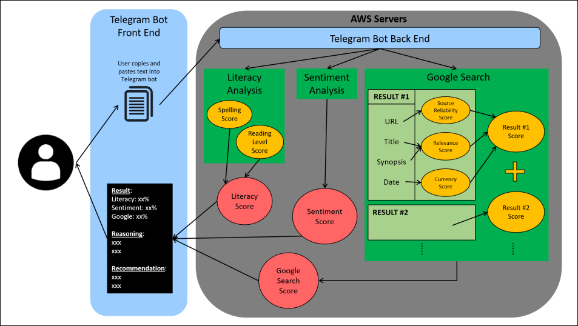
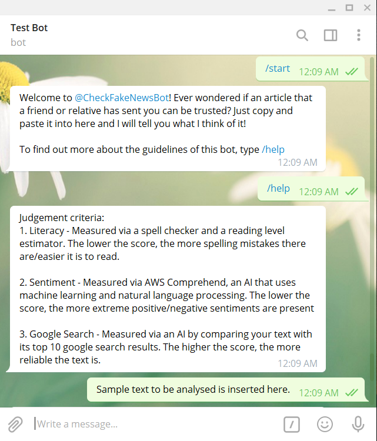
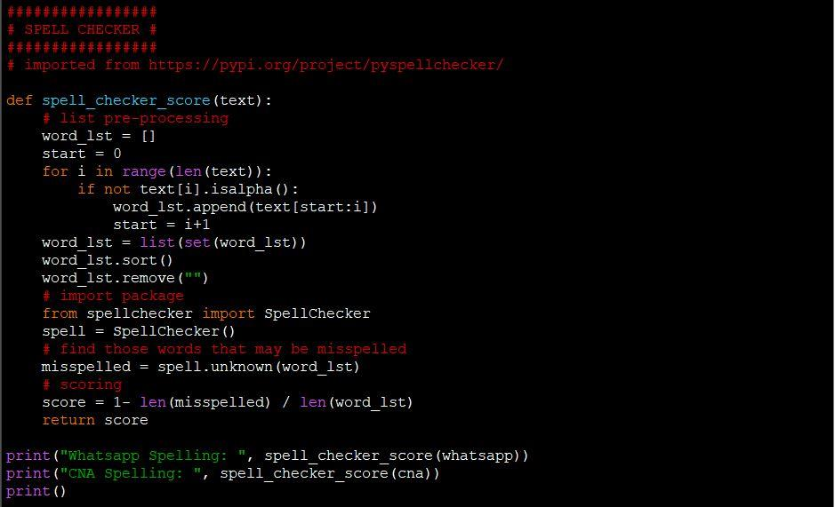
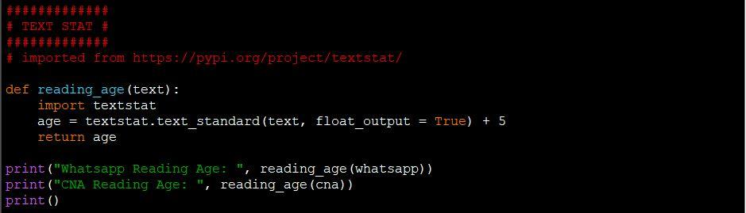
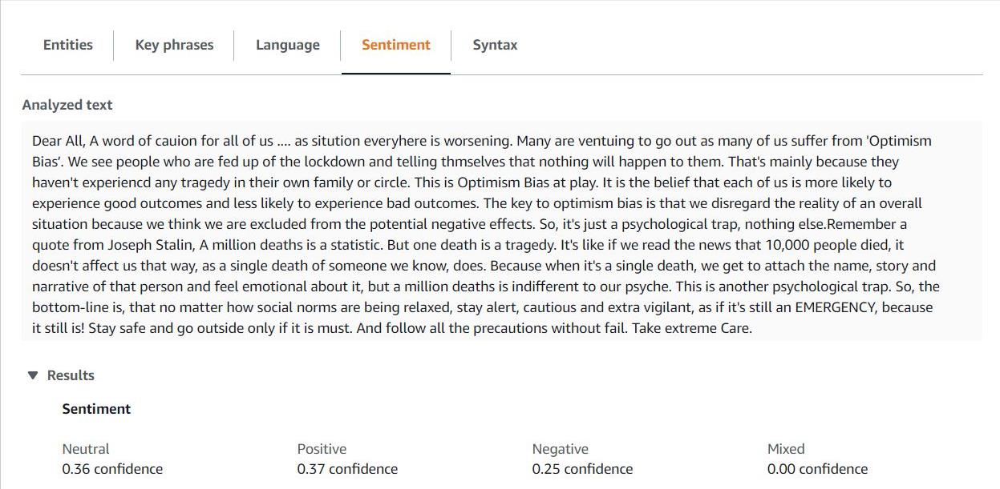
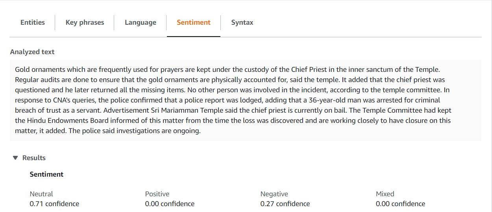
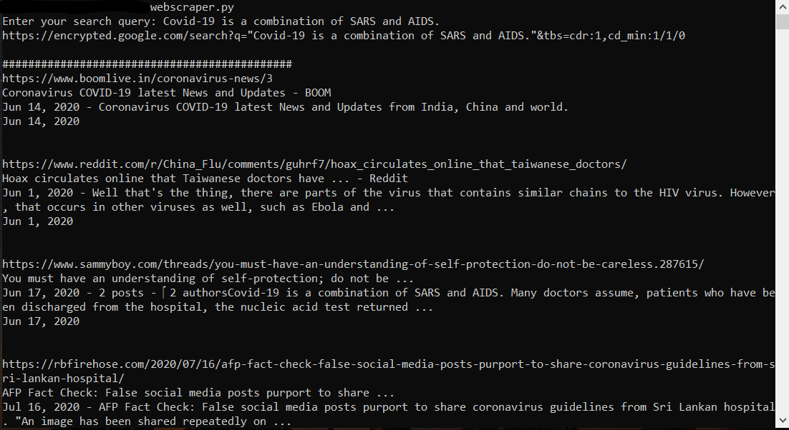
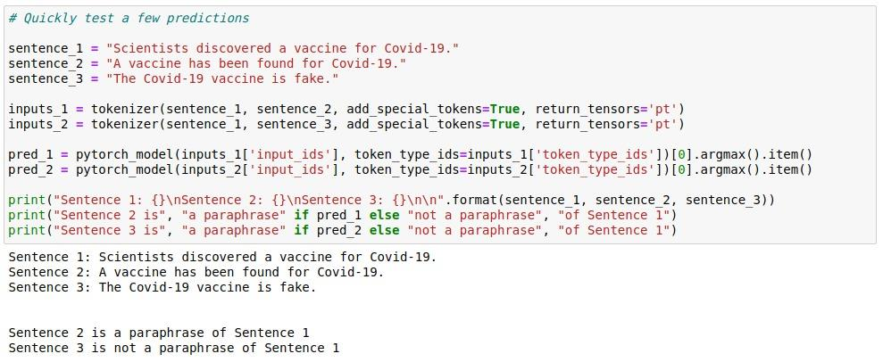
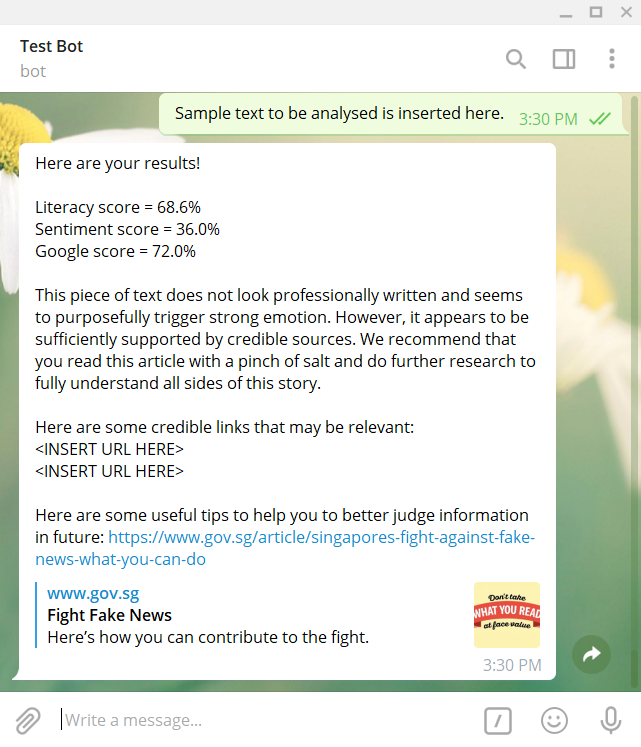

# Reliability Bot

Reliability Bot is created by Aiken Wong, Bryan Kwok, Chow En Rong, Lee Jae Ho, and Ryan Kwok.

Our solution has won the [**Semi-Finalist**](images/Certificate.pdf) award in **Build On, Singapore 2020** hackathon, organized by **AWS**.

To read our codebase, [here](https://github.com/First-Freshest-Freshies/build-on-telegram-bot)!

## Table of Contents

- [1. Introduction](#introduction)
- [2. Components](#components)
- [3. Architecture](#architecture)
- [4. Future Developments](#future)

## 1. Introduction
### Build On Singapore 2020 Hackathon

The **Build On competition** is a pan-ASEAN coding competition organised by **AWS**, taking place in Malaysia, Singapore, Cambodia, Thailand, Indonesia, Philippines, Myanmar, and Vietnam. Build On provides a platform for students to learn about **cloud computing** through designing and implementing tech solutions to real world challenges issued by institutions, corporates and start-ups across ASEAN.

### Problem Statement

**Cybercrimes/Infodemic& Misinformation**

With **fake news** and the **spread of misinformation** as one of the defining issues of our time, **incorrect, misleading or false advice** can travel around the world before anyone has a chance to correct it. From selling fake coronavirus cures online to a cyberattack on hospitals’ critical information systems, criminals are exploiting the **COVID-19 crisis**.

How can we help to curb **misinformation** and make tools smarter to **combat future infodemics**?

### Our Solution

**6 in 10** Singaporeans have received fake news about Covid19 from messaging platforms such as WhatsApp, Telegram, and Facebook [(Chew, 2020)](https://www.channelnewsasia.com/news/singapore/fake-covid-19-news-study-ncid-messaging-platforms-whatsapp-12756084). With such a trend comes growing concerns from individuals about how to guard against the spread of misinformation.

**Fret not! We have the Reliability Bot!**

If you have received a questionable message, and wish to quickly fact-check its content, all you have to do is to copy the text and send it to our Telegram bot. It will return its **reliability score** after running an analysis based on three criteria: literacy, sentiment, and corrobation.

## 2. Components

The following diagram outlines the overall process of our solution.

### Telegram Platform

The Telegram bot serves as the **front-end user interface** for our user to input the text they want to be analysed. Users interact with the bot via telegram commands, such as **‘/start’** to input their text or **‘/help’** to view the guidelines for using the bot. The bot will be hosted on AWS Lambd. User input passed in from the front-end of the bot gets sent to the Telegram servers.

This is in turn passed to **AWS Lambda** via a webhook, in which our Python script is executed to compute its reliability. Thereafter, the result will be sent back to the Telegram servers via a HTTP Post call and then delivered to users. The scores for each criterion (literacy, sentiment, and corroboration) are shown to educate the user on how to more critically judge information that they come across in future.

### Literacy Analysis

Literacy analysis consists of a **spell checker** and a **reading level estimator**. Since the Telegram backend is written in Python, we have also opted to use Python implementations of these programs. This code would be hosted on AWS Lambda.

The spell checker uses **‘pyspellchecker’** to check for spelling errors [(Barrus, 2020)](https://pypi.org/project/pyspellchecker/). This package utilises a **Levenshtein Distance algorithm** that analyses phrases to determine spelling errors within them. The total number of correctly spelled words is then taken as a percentage of all the words in the original text, producing a spelling score.

The second feature would be a reading level estimator. This would discern credible news articles which generally use more complex vocabulary and sentence structures compared to less credible messages that are usually simplified. We opted to use the Python package **‘textstat’** that determines the grade level of the text, based on the Flesch Reading Ease formula, Flesch-Kincaid Grade Level, Gunning FOG formula, SMOG index, Automated Readability Index, Coleman-Liau Index, Linsear Write Formula, and the Dale-Chall Readability Score [(Shivam Bansal, 2020)](https://pypi.org/project/textstat/). The grade output is the estimated **United States grade level** required to understand the text. The final score is the grade added to 5 to produce the age equivalent, which would be more relevant in Singapore’s context.

### Sentiment Analysis

**Journalistic objectivity** is one of the standards in news reporting. This means that any article with significantly positive or negative sentiment is less reliable, regardless of its factual truth. We aim to judge this using **AWS Comprehend**, which is a machine learning, natural language processing service. Accessed via AWS Lambda, the sentiment analysis service would be able to identify the overall sentiment of the text as either positive, negative, neutral, or mixed.

To demonstrate how this would work, we have used AWS Comprehend on a real text message spreading on WhatsApp, as well as a news article from Channel News Asia (CNA). As expected, the CNA article showed a higher neutral/mixed sentiment, which would ultimately translate into a higher sentiment score.

### Corroboration (Web Scraper for Google Search)

The web scraper is a Python script that takes the user input and inserts it into a **Google search query**. Since queries are done with keywords not a paragraph, AWS Comprehend would be used to **extract keywords** from the text before sending it into a google. This results in more accurate results with less “noise” for the Google algorithm.

As the Google search results page is dynamic, we will use a Python module ‘requests\_html’ to get and
fully render the website’s HTML via execution of its JavaScript code. From there, we parse the HTML
object with another module **‘BeautifulSoup’** in order to access individual HTML tags and their text content.

Each search result is divided into its URL, header, synopsis, and date published. The URL and date will be analysed to produce the source reliability score and the currency score. The header and synopsis will be passed on to an **AI model** for comparison and calculation of the relevance score. This Python script would be hosted on AWS Lambda.

### Corroboration (AI model)

In order to determine the relevance of a piece of text, a **semantic comparison** would be made between the user input and the search results (header and synopsis of news articles) from our web scraper. A high score would suggest that the Google search results corroborates with the user input. To do this, we will be using a state-of-the-art Natural Language Processing (NLP) model known as BERT - **Bidirectional Encoder Representations for Transformers**. Due to the high transferability of BERT encodings to other NLP tasks, we will be using a pre-trained base model trained on cased English text [(huggingface, 2020)](https://huggingface.co/transformers/pretrained_models.html).

Our preliminary model that was trained over **2-3 epochs** on either the Microsoft Research Paraphrase Corpus (MRPC) or the Semantic Textual Similarity Benchmark (STSB) datasets yielded respectable results of about **84% validation accuracy**. If we have the opportunity to, we recommend fine-tuning the model to our use case with a large, manually-generated training set using our web scraper.

### Generation of Reply

The three scores will be compiled to produce a **custom message** in order to cater to all the unique types of text input. This is because different scores would require different explanations and recommendations to be sent to the user. The tables below outline the variations of both the explanations and the recommendations that will be sent to the user.

| **Score Type** | **Sample Explanations** |
| --- | --- |
| Literacy | This piece of text (looks / does not look) very professionally written |
| Sentiment | (and / but) seems to give a neutral/balanced perspective. OR (and / but) seems to purposefully trigger strong emotions. |
| Corroboration | (However / Additionally), it appears to be (in)sufficiently supported by credible sources. |

| **Score Type** | **Sample Recommendations** |
| --- | --- |
| High Overall | This article seems well written and well supported! |
| High Corroboration with Low Literacy/Sentiment | Therefore, we recommend that you read this article with a pinch of salt and do further research to fully understand all sides of this story. |
| High Literacy/Sentiment with Low Corroboration | Hence, we recommend that you search up more articles from reputable sources to better understand the truths of this topic. |
| Low Overall | This article is poorly written and poorly supported, it is very likely that this was created to spread false information. We highly recommend that you seek more articles from reputable sources for more reliable information. You can also send me new texts you find! |

In addition to the reply, we would also share **one or two links** taken from our Google search. This aims to cultivate a habit of conducting further research for credible information in the user. This will be combined together with the explanation and recommendation to form a complete message.

## 3. Architecture

1. Since **Telegram** is the front-end application that the user would be accessing our solution from, AWS API Gateway would help to bridge the users to the process via a webhook.
2. Executing a command in Telegram would trigger the Python script in **AWS Lambda**. From here, a few processes would be initiated.
3. Firstly, another Python script would be run to execute the **literary analysis** of the text provided. This returns a score to the main script.
4. Secondly, **AWS Comprehend** would be triggered to analyse the text’s sentiments. Similarly, these scores would be sent back to the main code for computation. It will also be used to extract keywords for web scraping below.
5. Next, the script for the execution of the **Google search** would be triggered. This includes the query and web scraping of the result site. Results of the web scraping would be sent to AWS SageMaker.
6. A pre-trained machine learning model running on **AWS SageMaker** would then determine the relevance score by comparing the search results with the original text.
7. The main script would then collate all the **scores**. The three main scores (literacy, sentiment, and corroboration), along with the original text, would be sent to **AWS DynamoDB** for logging and possibly future development.
8. The **final results** would be sent back to the user via the Telegram bot.

## 4. Future Developments
### Commercialisation

Our solution was not designed for financial profit since the aim is to educate the general public. Hence, to better cater to education, we hope to again integrate more complex AI to better analyse reliability of the information. As of now, we are using basic guidelines to identify factors that might indicate that the information is unreliable. With more time, we can look into research papers and discover key information that can be derived from a text to better determine its reliability. We would then be able to train our AI to measure more of these features from our data set to produce more accurate results.

With a more research-backed foundation, we would then be able to pitch our solution to education institutions. Not only would our solution tackle “fake news”, but also aid students in better analysing information and sources when embarking on projects and reports in their schooling life. This will only boost the overall awareness and discernment of Singaporeans.

With all of that said, if commercialisation is a necessity, a potential financial market would be the journalism industry. As they aim to produce more objective and balanced news articles, an AI powered service would be useful for news agencies to progress towards that gold standard.

### Scaling

The first aspect to scaling would be the platform base. Telegram was chosen due to our familiarity with its API and its ease of use. However, with more time and financial resources, we hope to create a similar service for Facebook Messenger and WhatsApp to better target unreliable news that spread on these platforms. This digital scaling allows for our solution to be utilised by a greater pool of users with increasing ease.

Another aspect would be to expand geographically. This would not only mean being able to cater to a greater range of languages, but also being able to handle information from a greater number of sources.

However, the political and social situation in each country is unique, hence there would be different expectations of reliability of information. This also comes with determining the reliability of a greater number of news sources that we might not have even heard of. Scaling would definitely be possible, but only with more time, resources, and research.

### Further Improvements

With the limited time and access to data, we have to rely on open source material available online. While it generally achieves the goal, we would hope to integrate AI technologies to a greater extent. One benefit of a specifically trained AI is its ability to cater to specifically Singaporean characteristics. For example, the spell checker that we are using is a pre-trained model and does not include all words that may be used in a Singaporean context. Terms like temple names and MRT would be flagged out as misspellings.

In addition, more AI capabilities would be able to achieve greater detail and hence more accurate results. If possible, we would like to be able to scrape entire websites rather than just the Google results page. However, different websites have different formatting within their HTML code, making it difficult and complex to do web scraping for entire websites. With AI, we would be able to train a model to accurately identify news headlines and content from HTML pages that represent them in different formats. This would allow us to compare the content of a news article rather than just a snippet, increasing accuracy.

We acknowledge that the accuracy of the Google Search AI is not ideal at 84%. However, Natural Language Processing is still an evolving field in the world of neural networks, and BERT is already the State-of-the-Art encoding for language representation. Most advanced AI comparing semantics would also not reach accuracies above 90%. Hence, our approach would be mitigation, not a replacement.

The first step is ensuring that the AI is analysing what it is intended to analyse to maximise accuracy. Originally, we would send the entire user input as a whole into the Google query, and task the AI to compare the paragraph with the sentence in each result. However, comparing based on a large chunk of text would have inconsistencies especially when the search result is relevant to only specifically one sentence in the user input. Hence, we would have to break up the user input into individual sentence before conducting a Google query, and therefore have a more accurate sentence to sentence comparison.

Nevertheless, splitting the user input into single sentences will result in the loss of context. This is worsened with “meaningless sentences” which cannot be understood without the previous of subsequent sentence, also resulting in irrelevant Google search results. Considering both limitations, we have decided to split the user input into chunks of two sentences with overlap, to maximise AI accuracy and retain as much context as possible. To clarify, this would mean the first Google search would be done on sentence 1 and 2, followed by sentence 2 and 3, then sentence 3 and 4, so on and so forth. Clearly, this is subject to future developments. With improved AI or professional opinion by linguists, we can adjust the number of sentences to query and analyse text more accurately and efficiently.

In addition, another limitation observed is that the AI generally struggles with negation sentences such as “Tom is a human” and “Tom is not a human”. This would be very easily resolved with the use of Comprehend to determine the sentiment of the sentences in comparison. If the difference in sentiment exceeds a certain threshold, we can indicate that the likelihood of similarity is slim. 

Another tool that can help us mitigate problems with negation is the fact checker. Google Search contains a feature called Google Fact Check, which labels a search result as a “fact check” after meeting certain criteria established by 3rd party fact checkers. Hence, we could make use of this tool in our web scraper to recognise such results in order to produce a different score and send an alert to the user. This alert would be beneficial in notifying users of potential falsehoods.

